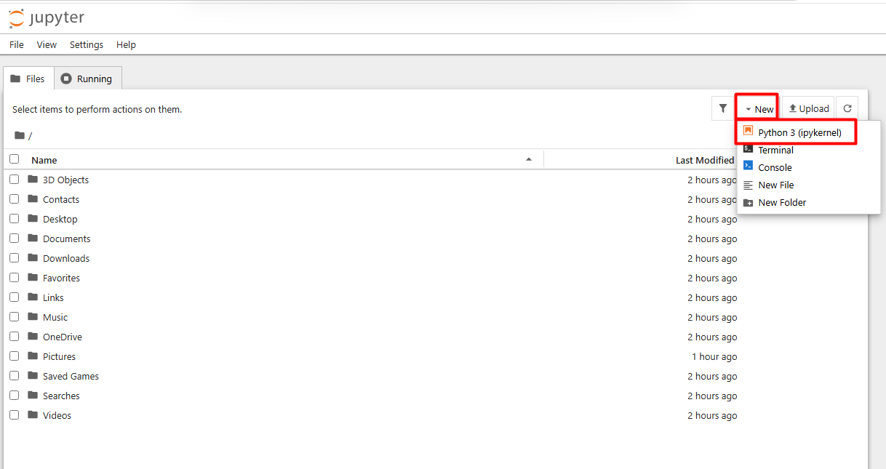

# Mapa de Oportunidades y Riesgos en un Caso Real

## Metadatos

| Campo            | Detalle                          |
|------------------|----------------------------------|
| **Duración**     | 30 minutos                       |
| **Complejidad**  | Fácil                            |
| **Nivel Bloom**  | Aplicar (Apply)                  |
| **Módulo**       | 1 — Fundamentos de GenAI         |

---

## Descripción General

En este laboratorio aplicarás los conceptos fundamentales de GenAI —modelos, prompts, tokens, alucinaciones y el flujo de cinco etapas— a un escenario empresarial concreto. Partiendo de un caso de uso real seleccionado de una lista curada, construirás una matriz comparativa de tecnologías, catalogarás oportunidades de negocio y riesgos clasificados, y producirás un **mapa de calor de riesgos** y una **tabla de oportunidades priorizadas** como artefactos listos para tomar decisiones. El foco es el análisis crítico y la estructuración del pensamiento; no se requiere código de producción.

---

## Objetivos de Aprendizaje

Al completar este laboratorio serás capaz de:

- [ ] Identificar y clasificar los componentes fundamentales de GenAI (modelos, prompts, tokens, alucinaciones) presentes en un escenario empresarial concreto.
- [ ] Completar una matriz comparativa que diferencie cuándo aplicar GenAI versus ML tradicional versus sistemas basados en reglas, justificando la elección con criterios técnicos y de negocio.
- [ ] Catalogar al menos 5 oportunidades de negocio y 8 riesgos clasificados por tipo (privacidad, seguridad, compliance, reputación), asignando probabilidad e impacto.
- [ ] Construir y exportar un mapa de calor de riesgos y una tabla de oportunidades priorizadas como artefactos de decisión.

---

## Prerrequisitos

### Conocimiento previo
- Lectura del material del Módulo 1, Lección 1.1: *Conceptos básicos de GenAI y flujo general*.
- Familiaridad básica con Jupyter Notebook: abrir un notebook, ejecutar celdas (`Shift+Enter`), editar celdas Markdown.
- Comprensión conceptual de los términos: LLM, prompt, token, alucinación, RLHF, flujo de cinco etapas.

### Acceso y herramientas
- Jupyter Notebook / JupyterLab instalado (local) **o** cuenta de Google Colab (sin costo).
- Python 3.10+ con las librerías `pandas`, `matplotlib` y `seaborn` instaladas.
- Acceso opcional a [ChatGPT](https://chat.openai.com) o [OpenAI Playground](https://platform.openai.com/playground) para observar ejemplos de alucinaciones en vivo (se proveen capturas de pantalla de respaldo en el repositorio del curso si no hay acceso).

---

## Entorno del Laboratorio

### Requisitos de hardware (mínimos para este lab)

| Recurso       | Mínimo requerido          |
|---------------|---------------------------|
| RAM           | 4 GB (sin operaciones de embedding) |
| Almacenamiento | < 100 MB (solo librerías estándar) |
| Conexión      | No requerida (trabajo offline posible) |

### Librerías Python necesarias

| Librería        | Versión mínima | Uso en este lab                        |
|-----------------|---------------|----------------------------------------|
| `pandas`        | 2.1           | Construcción de matrices de análisis   |
| `matplotlib`    | 3.8           | Visualización del mapa de calor        |
| `seaborn`       | 0.13          | Estilo del mapa de calor               |
| `jupyter`       | 7.0           | Entorno de ejecución del notebook      |

### Comandos de configuración del entorno

Ejecuta los siguientes comandos en tu terminal **antes** de abrir el notebook. Si usas Google Colab, ejecuta la celda de instalación incluida al inicio del notebook.

1. En tu máquina virtual ingresa a **Visual Studio Code**.

2. Abre una nueva terminal con la combinación de teclas **Ctrl + Ñ** o en el menú superior selecciona **Terminal** y luego **New Terminal**.

3. Ejecuta los siguientes comandos:

```powershell
# Verificar versión de Python
python --version

# Instalar/actualizar librerías necesarias
pip install pandas>=2.1 matplotlib>=3.8 seaborn>=0.13 notebook>=7.0

# Instalar ipywidgets
pip install ipywidgets

# Verificar instalación
python -c "import pandas, matplotlib, seaborn; print('Entorno listo')"

# Iniciar Jupyter Notebook
jupyter notebook
```
> En el listado de aplicaciones, selecciona **Microsoft Edge**.


---

## Pasos del Laboratorio

### Paso 1: Configuración del entorno y selección del caso de uso

**Objetivo:** Preparar el notebook de trabajo y seleccionar el escenario empresarial que analizarás durante todo el laboratorio.

#### Instrucciones

1. En la ventana del navegador, estando en Jupyter haz clic en **New** y luego en el menú desplegable **Python 3 (ipykernel)**. Abre Jupyter Notebook y crea un nuevo notebook llamado `lab_01_mapa_oportunidades_riesgos.ipynb`.



2. Cambia el nombre del Notebook por ```lab_01_mapa_oportunidades_riesgos.ipynb``` haciendo clic en **Untitled** del costado izquierdo. En la primera celda (tipo **Markdown**), copia y completa el siguiente encabezado de identificación:

```markdown
# Lab 01-00-01: Mapa de Oportunidades y Riesgos en GenAI

**Estudiante:** [Tu nombre]
**Fecha:** [Fecha de hoy]
**Caso de uso seleccionado:** [Escribe aquí tu elección]

## Caso de uso seleccionado
Elige UNO de los siguientes escenarios empresariales:

| # | Caso de Uso | Industria | Descripción breve |
|---|-------------|-----------|-------------------|
| A | Chatbot de atención al cliente | Retail / Banca | Responde consultas frecuentes, gestiona reclamos y deriva casos complejos a agentes humanos |
| B | Generación de informes financieros | Finanzas | Redacta automáticamente comentarios narrativos de resultados trimestrales a partir de datos estructurados |
| C | Asistente de RRHH | Recursos Humanos | Responde dudas de empleados sobre políticas, beneficios y procesos de onboarding |
| D | Análisis de contratos legales | Legal / Compliance | Extrae cláusulas clave, identifica riesgos y genera resúmenes ejecutivos de contratos |

**Mi selección: Caso [letra] — [nombre del caso]**

**Justificación (2-3 oraciones):** [Explica brevemente por qué elegiste este caso]
```

3. Agrega una nueva celda, haciendo clic en **+** del menú superior. En la segunda celda (tipo **Code**), ejecuta las importaciones y configuración global:

```python
# ============================================================
# LAB 01-00-01: Configuración inicial e Interfaz de Escenarios
# ============================================================
import pandas as pd
import matplotlib.pyplot as plt
import matplotlib.patches as mpatches
import seaborn as sns
import warnings
import ipywidgets as widgets
from IPython.display import display, clear_output

# 1. Ajustes globales de control de errores y entorno gráfico
warnings.filterwarnings('ignore')

plt.rcParams['figure.figsize'] = (12, 8)
plt.rcParams['font.family'] = 'DejaVu Sans'
sns.set_theme(style="whitegrid")

print(f"✅ Entorno gráfico inicializado (Pandas: {pd.__version__} | Matplotlib: {plt.matplotlib.__version__})")
print(f"📦 Cargando catálogo maestro de escenarios...")

# 2. Base de Datos Maestra: Centralización de todos los casos de uso disponibles
CASOS_CONFIG = {
    "A": {
        "nombre": "Chatbot de atención al cliente",
        "flujo": {
            "Etapa": ["1. Entrada del usuario", "2. Preprocesamiento y\nconstrucción del prompt", "3. Inferencia en el LLM", "4. Posprocesamiento\ny validación", "5. Salida al usuario"],
            "En mi caso de uso": [
                "El cliente escribe su consulta en el chat web o app móvil (ej: '¿Cuál es el estado de mi pedido #12345?')",
                "El sistema agrega: instrucciones del rol (agente de servicio), historial de la conversación, datos del cliente desde CRM, y la consulta actual",
                "GPT-4o-mini (o similar) procesa el prompt completo y genera la respuesta más probable; puede acceder a herramientas como búsqueda de pedidos",
                "Se verifica que la respuesta no contenga datos de otros clientes; se aplica filtro de tono; se registra en logs de auditoría",
                "El cliente recibe respuesta en el chat; si el sistema detecta insatisfacción, escala a agente humano"
            ],
            "Componente técnico clave": ["Interfaz de usuario / API de entrada", "Prompt engineering / Context window / Tokens", "LLM (GPT-4, Claude, Gemini) / Temperatura / Parámetros de generación", "Guardrails / Output parsers / Safety filters", "UI/UX / Integración con sistemas backend"],
            "Riesgo o punto de atención": ["Datos personales en la entrada (PII)", "Inyección de prompt / Prompt leaking", "Alucinaciones / Respuestas inconsistentes", "Falsos positivos en filtros / Latencia", "Expectativas del usuario vs. capacidades reales"]
        },
        "favorables": 6, "neutrales": 3, "desfavorables": 1
    },
    "B": {
        "nombre": "Generación de informes financieros",
        "flujo": {
            "Etapa": ["1. Entrada del usuario", "2. Preprocesamiento y\nconstrucción del prompt", "3. Inferencia en el LLM", "4. Posprocesamiento\ny validación", "5. Salida al usuario"],
            "En mi caso de uso": [
                "El analista financiero carga los estados financieros estructurados del trimestre (balances y P&L en formato Excel/CSV)",
                "El sistema extrae las tablas numéricas y ensambla un prompt utilizando plantillas contables y directrices de redacción corporativa",
                "Un LLM avanzado analiza las variaciones numéricas y redacta de manera automatizada los comentarios narrativos de los resultados",
                "Se aplican guardrails estrictos de validación matemática y consistencia factual cruzada contra los datos numéricos crudos de entrada",
                "Se genera un borrador del informe ejecutivo en formato Markdown/PDF para la revisión y aprobación final del CFO"
            ],
            "Componente técnico clave": ["Carga de archivos / Parsers de documentos", "Context Window / Plantillas contables estructuradas", "LLM con alta capacidad de razonamiento (GPT-4o / Claude 3.5)", "Filtros de consistencia numérica / Validadores lógicos", "Exportador de reportes dinámicos (PDF/Word)"],
            "Riesgo o punto de atención": ["Formatos de tablas financieras complejas", "Pérdida de contexto en ventanas de datos muy densas", "Alucinaciones numéricas (Riesgo crítico de negocio)", "Latencia en prompts extensos con múltiples dataframes", "Rigidez o falta de flexibilidad en la estructura narrativa genérica"]
        },
        "favorables": 4, "neutrales": 4, "desfavorables": 2
    },
    "C": {
        "nombre": "Asistente de RRHH",
        "flujo": {
            "Etapa": ["1. Entrada del usuario", "2. Preprocesamiento y\nconstrucción del prompt", "3. Inferencia en el LLM", "4. Posprocesamiento\ny validación", "5. Salida al usuario"],
            "En mi caso de uso": [
                "El empleado escribe una consulta libre en el portal interno (ej: '¿Cuántos días de licencia por paternidad me corresponden?')",
                "El sistema vectoriza la consulta y realiza una búsqueda semántica (RAG) sobre los manuales de beneficios y contratos colectivos",
                "El LLM sintetiza una respuesta clara y directa basándose de forma exclusiva en los fragmentos de políticas internas recuperados",
                "Se verifica que la respuesta mantenga un tono corporativo empático, no divulgue PII de terceros y respete los guardrails éticos",
                "El empleado recibe la respuesta en la interfaz junto con enlaces de referencia y origen al documento PDF oficial del manual"
            ],
            "Componente técnico clave": ["Chat de comunicación interna (Slack/Teams/Portal)", "Pipeline RAG / Embeddings / Vector Database corporativa", "LLM optimizado para tareas de síntesis de texto", "Guardrails de Privacidad / Control de accesos basado en roles (RBAC)", "Enlaces de origen mapeados en la UI de salida"],
            "Riesgo o punto de atención": ["Consultas de usuarios altamente ambiguas", "Documentación de políticas internas fragmentada o desactualizada", "Respuestas incorrectas sobre beneficios laborales legales", "Filtración involuntaria de datos salariales o PII de otros empleados", "Baja adopción si el sistema no genera confianza inmediata"]
        },
        "favorables": 7, "neutrales": 2, "desfavorables": 1
    },
    "D": {
        "nombre": "Análisis de contratos legales",
        "flujo": {
            "Etapa": ["1. Entrada del usuario", "2. Preprocesamiento y\nconstrucción del prompt", "3. Inferencia en el LLM", "4. Posprocesamiento\ny validación", "5. Salida al usuario"],
            "En mi caso de uso": [
                "El equipo legal o de compras carga un nuevo contrato comercial o acuerdo de confidencialidad (NDA) en formato PDF",
                "Se ejecuta un proceso de OCR en la nube para digitalizar el texto y se segmenta el contrato por cláusulas estándar",
                "El LLM analiza el texto completo para extraer metadatos clave (partes, vigencia) e identificar cláusulas de riesgo o penalidades ocultas",
                "Un output parser valida que la extracción legal cumpla de forma estricta con un esquema estructurado (JSON Schema o Pydantic)",
                "El abogado visualiza un panel con el resumen ejecutivo del contrato, alertas de riesgo (banderas rojas) y sugerencias de edición"
            ],
            "Componente técnico clave": ["Gestor documental / Pipeline OCR de alta fidelidad", "Chunking inteligente de contratos extensos", "LLM con ventana de contexto amplia y alto razonamiento legal", "JSON Schema Validators / Pydantic Output Parsers", "Dashboard interactivo de riesgos y desviaciones políticas"],
            "Riesgo o punto de atención": ["Baja calidad o ilegibilidad del texto escaneado", "Omisión involuntaria de términos en letras pequeñas o anexos", "Sesgos en la interpretación de términos legales ambiguos", "Falsos negativos en la identificación de riesgos u obligaciones", "Resistencia al cambio por parte de los auditores o abogados internos"]
        },
        "favorables": 5, "neutrales": 3, "desfavorables": 2
    }
}

# 3. Componente de Interfaz: Creación del menú desplegable interactivo
selector_caso = widgets.Dropdown(
    options=[
        ('Caso A: Chatbot de atención al cliente', 'A'),
        ('Caso B: Generación de informes financieros', 'B'),
        ('Caso C: Asistente de RRHH', 'C'),
        ('Caso D: Análisis de contratos legales', 'D')
    ],
    value='A',
    description='Escenario Activo:',
    style={'description_width': 'initial'},
    layout=widgets.Layout(width='50%')
)

# 4. Inicialización por defecto de las variables globales del entorno
CASO_SELECCIONADO = selector_caso.value
NOMBRE_CASO = CASOS_CONFIG[CASO_SELECCIONADO]["nombre"]
df_flujo = pd.DataFrame(CASOS_CONFIG[CASO_SELECCIONADO]["flujo"])
favorables = CASOS_CONFIG[CASO_SELECCIONADO]["favorables"]
neutrales = CASOS_CONFIG[CASO_SELECCIONADO]["neutrales"]
desfavorables = CASOS_CONFIG[CASO_SELECCIONADO]["desfavorables"]

# 5. Función Callback para interceptar el cambio de opción en la UI
def al_cambiar_caso(change):
    global CASO_SELECCIONADO, NOMBRE_CASO, df_flujo, favorables, neutrales, desfavorables
    clear_output(wait=True)
    display(selector_caso)
    
    # Actualización en caliente de las variables de estado
    CASO_SELECCIONADO = change['new']
    NOMBRE_CASO = CASOS_CONFIG[CASO_SELECCIONADO]["nombre"]
    df_flujo = pd.DataFrame(CASOS_CONFIG[CASO_SELECCIONADO]["flujo"])
    favorables = CASOS_CONFIG[CASO_SELECCIONADO]["favorables"]
    neutrales = CASOS_CONFIG[CASO_SELECCIONADO]["neutrales"]
    desfavorables = CASOS_CONFIG[CASO_SELECCIONADO]["desfavorables"]
    
    print("\n" + "="*60)
    print(f"🔄 ENTORNO ACTUALIZADO EN TIEMPO REAL")
    print(f"📌 Caso de Uso Seleccionado: {CASO_SELECCIONADO} — {NOMBRE_CASO}")
    print("="*60)
    print(f"👉 Ya puedes ejecutar las siguientes celdas (Paso 2 al 7b) sin modificar código.")

# Vincular el evento de cambio al selector y pintar la interfaz inicial
selector_caso.observe(al_cambiar_caso, names='value')

display(selector_caso)
print(f"\n🚀 Sistema listo. Selecciona un caso en el menú desplegable de arriba para comenzar.")
```

4. Ejecuta la celda (`Shift+Enter`) y confirma que no hay errores.

#### Salida esperada

```
✅ Entorno gráfico inicializado (Pandas: 3.0.3 | Matplotlib: 3.11.0)
📦 Cargando catálogo maestro de escenarios...
Escenario Activo:

Caso A: Chatbot de atención al cliente

🚀 Sistema listo. Selecciona un caso en el menú desplegable de arriba para comenzar.
```

#### Verificación

> Selecciona el escenario que deseas del menú desplegable.

---

### Paso 2: Mapeo del flujo GenAI en el caso de uso

**Objetivo:** Identificar cómo se manifiestan las cinco etapas del flujo general de GenAI (entrada → preprocesamiento → inferencia → posprocesamiento → salida) en el escenario empresarial elegido.

#### Instrucciones

1. Agrega una nueva celda **Markdown** con el siguiente título de sección:

```markdown
## Paso 2: Flujo General de GenAI Aplicado al Caso de Uso

Recuerda el flujo de cinco etapas de la Lección 1.1:
**Entrada → Preprocesamiento → Inferencia → Posprocesamiento → Salida**

Para cada etapa, describe cómo se materializa en tu caso de uso específico.
```

2. Agrega una celda **Code** y completa el diccionario `flujo_caso` con descripciones específicas de **tu** caso de uso. El ejemplo a continuación usa el Caso A (chatbot de atención al cliente); **adapta cada descripción a tu caso seleccionado**:

```python
# ============================================================
# Paso 2: Ciclo de vida y mapeo del flujo GenAI al escenario
# ============================================================

print("=" * 80)
print(f"FLUJO DE DATOS GenAI — {NOMBRE_CASO} (Caso {CASO_SELECCIONADO})")
print("=" * 80)

# Definir las columnas que queremos visualizar en la consola
cols_flujo = ["Etapa", "En mi caso de uso", "Componente técnico clave", "Riesgo o punto de atención"]

# Mostrar la tabla formateada sin índices numéricos
print(df_flujo[cols_flujo].to_string(index=False))

print("\n" + "=" * 80)
print(f"✅ Flujo de 5 etapas cargado exitosamente en memoria corporativa.")
```

3. Ejecuta la celda y revisa que la tabla se muestre correctamente.

4. **Reflexión crítica** — Agrega una celda **Markdown** y responde las siguientes preguntas (2-3 oraciones cada una):

```markdown
### Reflexión: Flujo en mi caso de uso

**¿En qué etapa del flujo crees que se generan más riesgos para tu caso?**
[Tu respuesta aquí]

**¿Qué etapa es más crítica para la calidad de la experiencia del usuario final?**
[Tu respuesta aquí]

**¿Dónde aparecen los tokens en el flujo de tu caso? ¿Qué implicaciones tiene esto en costo?**
[Tu respuesta aquí]
```

#### Salida esperada

Una tabla con 5 filas (una por etapa) y 5 columnas, mostrando la descripción general, la aplicación específica al caso de uso, el componente técnico clave y el riesgo asociado.

#### Verificación

- [ ] La tabla `df_flujo` se genera sin errores y muestra las 5 etapas.
- [ ] La columna "En mi caso de uso" refleja el caso que seleccionaste (no el ejemplo genérico).
- [ ] Has respondido las tres preguntas de reflexión en la celda Markdown.

---

### Paso 3: Matriz comparativa GenAI vs. ML tradicional vs. Reglas

**Objetivo:** Determinar si GenAI es la tecnología más adecuada para el caso de uso seleccionado, comparándola con alternativas mediante criterios técnicos y de negocio.

#### Instrucciones

1. Agrega una celda **Markdown**:

```markdown
## Paso 3: Matriz Comparativa de Tecnologías

¿Es GenAI la mejor opción para este caso? Comparemos con las alternativas.
```

2. Agrega una celda **Code** con la matriz comparativa. **Completa la columna de tu caso de uso** (marcada con `⚠️ TAREA`):

```python
# ============================================================
# Paso 3: Matriz comparativa de tecnologías
# ============================================================

# Nombre de la columna adaptado dinámicamente según la selección global
columna_dinamica = f"¿Aplica GenAI a mi caso? ({CASO_SELECCIONADO})"

criterios = {
    "Criterio de evaluación": [
        "Manejo de lenguaje natural no estructurado",
        "Variedad de preguntas (long tail)",
        "Explicabilidad de la decisión",
        "Costo de mantenimiento a largo plazo",
        "Velocidad de implementación inicial",
        "Consistencia y reproducibilidad",
        "Adaptación a nuevos dominios",
        "Costo operativo por consulta",
        "Riesgo de respuestas incorrectas",
        "Cumplimiento regulatorio (auditoría)"
    ],
    "GenAI (LLM)": [
        "⭐⭐⭐⭐⭐ Excelente",
        "⭐⭐⭐⭐⭐ Excelente",
        "⭐⭐ Limitada (caja negra)",
        "⭐⭐⭐⭐ Bajo (sin reentrenamiento frecuente)",
        "⭐⭐⭐⭐⭐ Muy rápida (prompt engineering)",
        "⭐⭐⭐ Media (temperatura afecta variabilidad)",
        "⭐⭐⭐⭐⭐ Alta (few-shot, fine-tuning)",
        "⭐⭐ Alto (costo por token)",
        "⭐⭐ Alto (alucinaciones posibles)",
        "⭐⭐ Difícil (no determinístico)"
    ],
    "ML Tradicional (supervisado)": [
        "⭐⭐ Limitado (requiere features manuales)",
        "⭐⭐ Limitado (clases predefinidas)",
        "⭐⭐⭐⭐ Alta (modelos interpretables)",
        "⭐⭐⭐ Medio (reentrenamiento periódico)",
        "⭐⭐⭐ Media (requiere datos etiquetados)",
        "⭐⭐⭐⭐⭐ Alta (determinístico)",
        "⭐⭐ Baja (requiere nuevos datos y entrenamiento)",
        "⭐⭐⭐⭐ Bajo (inferencia local)",
        "⭐⭐⭐⭐ Bajo (dentro de distribución)",
        "⭐⭐⭐⭐ Auditable"
    ],
    "Sistemas basados en reglas": [
        "⭐ Muy limitado",
        "⭐ Muy limitado (solo casos previstos)",
        "⭐⭐⭐⭐⭐ Perfecta (lógica explícita)",
        "⭐ Muy alto (mantenimiento manual constante)",
        "⭐⭐ Lenta (diseño de reglas)",
        "⭐⭐⭐⭐⭐ Perfecta",
        "⭐ Muy baja (cambio requiere rediseño)",
        "⭐⭐⭐⭐⭐ Muy bajo",
        "⭐⭐⭐⭐⭐ Muy bajo (dentro de reglas)",
        "⭐⭐⭐⭐⭐ Totalmente auditable"
    ],
    # ⚠️ TAREA: Evalúa cada criterio para TU caso de uso específico
    # Usa: ✅ Favorable | ⚠️ Neutral | ❌ Desfavorable
    columna_dinamica: [
        "✅ Texto libre no estructurado de usuarios" if CASO_SELECCIONADO != "B" else "⚠️ Requiere combinar tablas numéricas densas y texto libre",
        "✅ Variedad infinita de escenarios posibles" if CASO_SELECCIONADO in ["A", "C", "D"] else "⚠️ Enfocado en reportes corporativos periódicos fijos",
        "⚠️ Se requieren logs extensos y auditoría de decisiones",
        "✅ Permite iterar sin un equipo masivo de ML dedicado en la empresa",
        "✅ Urge salir a producción en el corto plazo (<3 meses)",
        "⚠️ Crítico: Se necesitan guardrails robustos de control de salida",
        "✅ Escalable a nuevos productos o normativas de forma ágil mediante prompts",
        "⚠️ El volumen de consultas/reportes impactará directamente el costo de tokens",
        "❌ Riesgo de alucinación crítico; requiere validación o arquitectura de soporte (RAG)",
        "⚠️ Exige flujos estrictos de logging corporativo y trazabilidad"
    ]
}

df_comparativa = pd.DataFrame(criterios)

print("=" * 80)
print("MATRIZ COMPARATIVA: GenAI vs. ML Tradicional vs. Reglas")
print(f"Aplicada al caso: {NOMBRE_CASO}")
print("=" * 80)

# Mostrar criterios y evaluación del caso
for i, row in df_comparativa.iterrows():
    print(f"\n📌 {row['Criterio de evaluación']}")
    print(f"   GenAI:    {row['GenAI (LLM)']}")
    print(f"   ML Trad.: {row['ML Tradicional (supervisado)']}")
    print(f"   Reglas:   {row['Sistemas basados en reglas']}")
    print(f"   Mi caso:  {row[columna_dinamica]}")

# Conteo de favorabilidad
favorables = df_comparativa[columna_dinamica].str.count('✅').sum()
neutrales = df_comparativa[columna_dinamica].str.count('⚠️').sum()
desfavorables = df_comparativa[columna_dinamica].str.count('❌').sum()

print(f"\n{'='*80}")
print(f"RESUMEN DE EVALUACIÓN PARA CASO {CASO_SELECCIONADO}:")
print(f"   ✅ Criterios favorables para GenAI: {favorables}/10")
print(f"   ⚠️  Criterios neutrales/mixtos:      {neutrales}/10")
print(f"   ❌ Criterios desfavorables:          {desfavorables}/10")
print(f"\n📊 Veredicto: {'GenAI ES una opción viable' if favorables >= 5 else 'Considerar alternativas o enfoque híbrido'}")
```

3. Ejecuta la celda y revisa el veredicto automático.

4. Agrega una celda **Markdown** con tu conclusión:

```markdown
### Conclusión de la Matriz Comparativa

**¿Es GenAI la tecnología correcta para este caso? ¿Por qué?**
[Tu análisis en 3-5 oraciones, citando al menos 3 criterios de la matriz]

**¿Qué enfoque híbrido podría ser más robusto?**
[Ejemplo: "GenAI para comprensión de lenguaje natural + reglas de negocio para validación de datos críticos"]
```

#### Salida esperada

Listado de los 10 criterios con evaluación de las tres tecnologías y la evaluación específica del caso, seguido del resumen de favorabilidad y el veredicto.

#### Verificación

- [ ] La matriz se genera correctamente con los 10 criterios.
- [ ] La columna de tu caso refleja evaluaciones personalizadas (no solo el ejemplo).
- [ ] El veredicto final tiene sentido con las evaluaciones que ingresaste.

---

### Paso 4: Catálogo de oportunidades de negocio

**Objetivo:** Identificar y priorizar al menos 5 oportunidades de valor que GenAI puede generar en el caso de uso seleccionado.

#### Instrucciones

1. Agrega una celda **Markdown**:

```markdown
## Paso 4: Catálogo de Oportunidades de Negocio

Para cada oportunidad, evaluamos:
- **Impacto en negocio** (1-5): ¿Cuánto valor genera?
- **Facilidad de implementación** (1-5): ¿Qué tan fácil es implementarla? (5 = muy fácil)
- **Tiempo estimado**: Corto (<3m), Medio (3-6m), Largo (>6m)
- **KPI asociado**: Métrica que evidencia el valor
```

2. Agrega una celda **Code** con el catálogo de oportunidades. **Agrega al menos 2 oportunidades adicionales** específicas de tu caso:

```python
# ============================================================
# Paso 4: Catálogo de oportunidades de negocio
# ============================================================

# Inyección dinámica de textos y métricas según el caso seleccionado en el Paso 1
if CASO_SELECCIONADO == "B":  # Generación de informes financieros
    opp_nombres = [
        "Automatización del borrador narrativo",
        "Consolidación ágil multiclave",
        "Estandarización de reportes trimestrales",
        "Análisis de variaciones instantáneo",
        "Liberación de analistas seniors",
        "Reportes internos bajo demanda",
        "Detección de anomalías contables"
    ]
    opp_desc = [
        "Reducción de días a minutos en el primer borrador de comentarios",
        "Une datos de filiales con formatos heterogéneos sin esfuerzo manual",
        "Mismo tono contable sin importar qué analista compile los datos",
        "Identifica causas raíz de desviaciones de presupuesto al momento",
        "Foco en estrategia financiera y proyecciones, no en redactar plantillas",
        "Auditoría preliminar automatizada los fines de semana",
        "Alertas preventivas sobre registros contables atípicos"
    ]
    opp_kpis = [
        "Tiempo de entrega del primer borrador (días)",
        "Horas de conciliación manual reducidas",
        "% de consistencia en el formato del reporte",
        "Tiempo de respuesta ante variaciones (min)",
        "Horas hombre liberadas para análisis estratégico",
        "Número de reportes generados bajo demanda",
        "Tasa de falsos positivos en anomalías"
    ]
    opp_valores = [
        "Eficiencia operativa", "Integración de datos", "Estandarización",
        "Inteligencia de negocio", "Optimización de recursos",
        "Autoservicio analítico", "Mitigación de riesgos"
    ]
elif CASO_SELECCIONADO == "C":  # Asistente de RRHH
    opp_nombres = [
        "Resolución inmediata de dudas de nómina",
        "Onboarding autónomo 24/7",
        "Centralización del manual del empleado",
        "Soporte de beneficios personalizado",
        "Descongestionamiento del equipo de RRHH",
        "Encuestas de clima automatizadas",
        "Detección proactiva de riesgo de fuga"
    ]
    opp_desc = [
        "Respuestas en segundos sobre licencias, primas y retenciones",
        "Guía interactiva al nuevo talento sin requerir llamadas presenciales",
        "Acceso unificado a decenas de PDFs de políticas internas dispersas",
        "Respuestas adaptadas al tipo de contrato y antigüedad del empleado",
        "Foco en desarrollo, capacitación y cultura organizacional",
        "Análisis de sentimiento semanal automatizado",
        "Identifica patrones de descontento o desvinculación latente"
    ]
    opp_kpis = [
        "Tiempo promedio de resolución de consultas",
        "% avance autónomo en onboarding",
        "Tasa de consultas resueltas vía RAG",
        "Nivel de satisfacción del empleado (eNPS)",
        "Reducción de tickets escalados a RRHH",
        "Índice de participación en encuestas",
        "Tasa de retención de talento clave"
    ]
    opp_valores = [
        "Eficiencia operativa", "Experiencia de empleado", "Centralización",
        "Personalización", "Optimización de recursos",
        "Cultura corporativa", "Retención de talento"
    ]
elif CASO_SELECCIONADO == "D":  # Análisis de contratos legales
    opp_nombres = [
        "Auditoría acelerada de contratos (Due Diligence)",
        "Extracción automatizada de metadatos",
        "Banderas rojas en cláusulas de riesgo",
        "Estandarización de penalidades",
        "Liberación del equipo legal interno",
        "Comparativa de versiones contractuales",
        "Análisis preventivo de riesgos de compliance"
    ]
    opp_desc = [
        "Revisión masiva de contratos comerciales reducida en un 70% de tiempo",
        "Identifica firmantes, vigencias y montos en segundos usando esquemas estructurados",
        "Alertas inmediatas si la cláusula de indemnidad viola la política de la empresa",
        "Garantiza que las multas de proveedores sigan el estándar corporativo",
        "Foco en negociaciones complejas y litigios estratégicos de alto valor",
        "Mapeo de cambios clave entre el borrador del proveedor y la plantilla interna",
        "Evita multas regulatorias al cruzar los contratos con nuevas normativas"
    ]
    opp_kpis = [
        "Tiempo promedio de revisión por contrato",
        "Precisión en la extracción de metadatos (%)",
        "Tasa de contratos con riesgos no detectados",
        "% cumplimiento de políticas de penalidad",
        "Horas dedicadas a tareas de alto valor legal",
        "Tiempo de ciclo en mesas de negociación",
        "Costo evitado por sanciones de compliance"
    ]
    opp_valores = [
        "Velocidad de ejecución", "Estructuración de datos", "Control de riesgos",
        "Estandarización", "Optimización de recursos",
        "Agilidad comercial", "Gobernanza y Cumplimiento"
    ]
else:  # Por defecto: Caso A (Chatbot de atención al cliente)
    opp_nombres = [
        "Reducción de tiempo de respuesta al cliente",
        "Disponibilidad 24/7 sin costo incremental",
        "Escalabilidad ante picos de demanda",
        "Personalización de respuestas por perfil de cliente",
        "Liberación de agentes humanos para casos complejos",
        "Generación automática de reportes de satisfacción",
        "Detección proactiva de patrones de insatisfacción"
    ]
    opp_desc = [
        "De 5-10 min promedio a respuesta instantánea para consultas frecuentes",
        "El chatbot opera fuera de horario laboral sin costo de personal adicional",
        "Maneja 1000 consultas simultáneas sin degradación de servicio",
        "Adapta tono y nivel técnico según historial y segmento del cliente",
        "El 70-80% de consultas resueltas automáticamente; agentes atienden casos de alto valor",
        "Genera resumen semanal de temas frecuentes, sentimiento y áreas de mejora",
        "Identifica clientes en riesgo de churn por patrones de queja recurrente"
    ]
    opp_kpis = [
        "Tiempo promedio de primera respuesta (FRT)",
        "% consultas resueltas fuera de horario",
        "Capacidad de consultas simultáneas",
        "CSAT por segmento de cliente",
        "% deflección (consultas resueltas sin agente)",
        "NPS semanal automatizado",
        "Tasa de retención de clientes (churn rate)"
    ]
    opp_valores = [
        "Eficiencia operativa", "Expansión de servicio", "Escalabilidad",
        "Experiencia de cliente", "Optimización de recursos",
        "Inteligencia de negocio", "Retención de clientes"
    ]

oportunidades = {
    "ID": ["OPP-01", "OPP-02", "OPP-03", "OPP-04", "OPP-05", "OPP-06", "OPP-07"],
    "Oportunidad": opp_nombres,
    "Descripción": opp_desc,
    "Impacto (1-5)": [5, 4, 4, 3, 5, 3, 4],
    "Facilidad (1-5)": [5, 5, 4, 3, 4, 4, 3],
    "Tiempo estimado": [
        "Corto (<3m)", "Corto (<3m)", "Medio (3-6m)",
        "Medio (3-6m)", "Corto (<3m)", "Medio (3-6m)", "Largo (>6m)"
    ],
    "KPI asociado": opp_kpis,
    "Tipo de valor": opp_valores
}

df_opp = pd.DataFrame(oportunidades)

df_opp["Score de priorización"] = (
    df_opp["Impacto (1-5)"] * df_opp["Facilidad (1-5)"]
)

df_opp_sorted = df_opp.sort_values("Score de priorización", ascending=False).reset_index(drop=True)

print("=" * 80)
print(f"OPORTUNIDADES DE NEGOCIO — {NOMBRE_CASO}")
print("Ordenadas por Score de Priorización (Impacto × Facilidad)")
print("=" * 80)

cols_display = ["ID", "Oportunidad", "Impacto (1-5)",
                "Facilidad (1-5)", "Score de priorización",
                "Tiempo estimado", "KPI asociado"]
print(df_opp_sorted[cols_display].to_string(index=False))

print(f"\n📊 Total de oportunidades identificadas: {len(df_opp)}")
print(f"🏆 Oportunidad top: {df_opp_sorted.iloc[0]['Oportunidad']}")
print(f"   Score: {df_opp_sorted.iloc[0]['Score de priorización']}/25")
```

3. Ejecuta la celda y verifica que el score de priorización se calcula correctamente.

#### Salida esperada

Tabla ordenada de oportunidades con score de priorización calculado, mostrando las oportunidades de mayor impacto y facilidad de implementación en los primeros lugares.

#### Verificación

- [ ] El DataFrame contiene al menos 7 oportunidades (5 base + 2 propias del caso).
- [ ] Los scores de priorización están calculados correctamente (impacto × facilidad, máximo 25).
- [ ] Las oportunidades están ordenadas de mayor a menor score.

---

### Paso 5: Catálogo y clasificación de riesgos

**Objetivo:** Identificar, clasificar y evaluar al menos 8 riesgos del caso de uso, asignando probabilidad e impacto para construir la base del mapa de calor.

#### Instrucciones

1. Agrega una celda **Markdown**:

```markdown
## Paso 5: Catálogo de Riesgos Clasificados

Clasificamos los riesgos en 4 categorías:
- 🔒 **Privacidad**: Exposición o mal uso de datos personales
- 🛡️ **Seguridad**: Vulnerabilidades técnicas, ataques, accesos no autorizados
- ⚖️ **Compliance**: Incumplimiento de regulaciones (GDPR, CCPA, regulaciones sectoriales)
- 🏢 **Reputación**: Daño a la imagen de marca, confianza del cliente o stakeholders

Escala de evaluación:
- **Probabilidad**: 1 (Muy baja) → 5 (Muy alta)
- **Impacto**: 1 (Mínimo) → 5 (Catastrófico)
- **Nivel de riesgo** = Probabilidad × Impacto (máximo 25)
```

2. Agrega una celda **Code** con el catálogo de riesgos:

```python
# ============================================================
# Paso 5: Catálogo de riesgos clasificados
# ============================================================

# Inyección dinámica de datos del catálogo según el caso seleccionado en el Paso 1
if CASO_SELECCIONADO == "B":  # Generación de informes financieros
    riesgo_titulos = [
        "Exposición de datos financieros confidenciales en respuestas",
        "Filtración de información de una filial en respuesta a otra",
        "Inyección de prompt por usuario malicioso",
        "Acceso no autorizado a la API del LLM",
        "Incumplimiento del GDPR por procesamiento de datos en servidores externos",
        "Ausencia de base legal para procesamiento de datos con IA",
        f"Alucinaciones críticas en {NOMBRE_CASO}",
        "Sesgo en la interpretación de variaciones contables",
        "Pérdida de confianza por errores públicos en informes trimestrales",
        "Dependencia de un único proveedor de LLM (vendor lock-in)"
    ]
    riesgo_descripciones = [
        "El LLM incluye métricas financieras internas o proyecciones no aprobadas en respuestas sin anonimización",
        "El contexto de un sector o filial contamina la respuesta generada para otra entidad (cross-contamination)",
        "Un usuario manipula el system prompt para extraer instrucciones internas, metodologías o datos crudos",
        "Credenciales de API expuestas en código o repositorios corporativos públicos",
        "Los datos de clientes o balances europeos se procesan en servidores fuera de la UE sin garantías adecuadas",
        "No se obtiene el consentimiento o autorización regulatoria explícita para el procesamiento automatizado con IA",
        "El sistema afirma tendencias financieras inexistentes o altera valores numéricos simulando precisión factual",
        "El modelo penaliza o beneficia en su narrativa ciertos segmentos de negocio debido a datos históricos sesgados",
        "Un error numérico viralizado en un informe de resultados genera repercusiones en auditorías externas",
        "Interrupción del flujo de reporting si el proveedor de LLM tiene downtime o cambia precios drásticamente"
    ]
    riesgo_probabilidades = [3, 2, 3, 2, 4, 3, 4, 2, 3, 3]
    riesgo_impactos       = [5, 5, 4, 4, 5, 4, 5, 3, 5, 3]  # Impacto máximo (5) en alucinaciones y reputación por regulaciones contables
    riesgo_mitigaciones = [
        "Anonimización y enmascaramiento de métricas previas; validación cruzada obligatoria",
        "Aislamiento de contextos por filial; separación estricta de dataframes en memoria",
        "Validación exhaustiva de entradas; reglas robustas de control de prompts; filtros de salida",
        "Gestión segura de secrets (variables de entorno, vault); rotación periódica de claves",
        "Usar proveedores con Data Processing Agreements (DPA) y servidores en regiones aprobadas",
        "Actualizar políticas corporativas; implementar controles y auditorías internas de gobernanza",
        "Implementar arquitectura RAG integrada con bases contables certificadas y validadores lógicos numéricos",
        "Pruebas continuas de consistencia lógica; auditoría periódica de las narrativas generadas",
        "Mecanismo Human-in-the-loop estricto: revisión por auditores/CFO antes de emitir cualquier reporte",
        "Diseño arquitectónico multi-proveedor desacoplado; contratos con SLA de alta disponibilidad"
    ]
elif CASO_SELECCIONADO == "C":  # Asistente de RRHH
    riesgo_titulos = [
        "Exposición de datos personales y salariales en respuestas",
        "Filtración de información de un empleado en respuesta a otro",
        "Inyección de prompt por usuario malicioso",
        "Acceso no autorizado a la API del LLM",
        "Incumplimiento del GDPR por procesamiento de datos en servidores externos",
        "Ausencia de base legal para procesamiento de datos con IA",
        f"Alucinaciones críticas en {NOMBRE_CASO}",
        "Sesgo en respuestas sobre beneficios o políticas",
        "Pérdida de confianza por errores públicos del asistente interno",
        "Dependencia de un único proveedor de LLM (vendor lock-in)"
    ]
    riesgo_descripciones = [
        "El LLM expone PII sensible (salarios, amonestaciones, historial médico) en sus respuestas sin anonimización",
        "El contexto o historial de un colaborador contamina la sesión activa de otro usuario (cross-contamination)",
        "Un empleado manipula el prompt para forzar al sistema a revelar datos confidenciales del departamento",
        "Credenciales de acceso a la API o bases vectoriales expuestas en entornos desprotegidos",
        "El procesamiento de datos de empleados europeos se realiza fuera de la UE sin el marco legal adecuado",
        "Falta de claridad en los contratos laborales sobre el tratamiento de datos mediante algoritmos de IA",
        "El asistente inventa días de licencia, bonos o políticas de onboarding que no existen formalmente",
        "El modelo ofrece interpretaciones dispares de las normativas según género o demografía del usuario",
        "Respuestas erróneas recurrentes generan fricción con el sindicato o reclamos colectivos internos",
        "Caída del asistente de soporte interno en periodos críticos de nómina o evaluación anual"
    ]
    riesgo_probabilidades = [3, 2, 3, 2, 4, 3, 3, 2, 3, 3]
    riesgo_impactos       = [5, 5, 4, 4, 5, 4, 4, 4, 4, 3]
    riesgo_mitigaciones = [
        "Filtros de anonimización automáticos de PII; control estricto en la extracción de embeddings",
        "Control de accesos basado en roles (RBAC) integrado directamente en las consultas de la Vector DB",
        "Sanitización estricta de inputs; límites en la ventana de chat; bloqueo de palabras clave",
        "Uso de bóvedas digitales de seguridad (Vault) para el almacenamiento de tokens de API",
        "Alineación con proveedores cloud que cumplan con esquemas de protección y hosting regional",
        "Inclusión de anexos de consentimiento explícito en el portal de contratación del empleado",
        "Estrategia RAG estricta anclada únicamente a PDFs vigentes del manual; enlaces directos a la fuente",
        "Evaluaciones periódicas de sesgo en lenguaje; auditorías automatizadas sobre el set de evaluación",
        "Habilitar un botón claro de reporte de errores y canal de escalado directo al equipo físico de RRHH",
        "Sistemas redundantes y despliegue local de modelos open-source como respaldo operativo"
    ]
elif CASO_SELECCIONADO == "D":  # Análisis de contratos legales
    riesgo_titulos = [
        "Exposición de datos personales u obligaciones en respuestas",
        "Filtración de información de un contrato en respuesta a otro",
        "Inyección de prompt por usuario malicioso",
        "Acceso no autorizado a la API del LLM",
        "Incumplimiento del GDPR por procesamiento de datos en servidores externos",
        "Ausencia de base legal para procesamiento de datos con IA",
        f"Alucinaciones críticas en {NOMBRE_CASO}",
        "Sesgo en la extracción de riesgos u obligaciones",
        "Pérdida de confianza por errores públicos del sistema de análisis",
        "Dependencia de un único proveedor de LLM (vendor lock-in)"
    ]
    riesgo_descripciones = [
        "El LLM extrae o comparte nombres, montos y penalidades en reportes compartidos sin la debida anonimización",
        "Cláusulas confidenciales de un acuerdo comercial se mezclan en la evaluación de otra entidad (cross-contamination)",
        "Un usuario inyecta texto malicioso dentro de un contrato cargado para saltarse las restricciones de seguridad",
        "Exposición accidental de llaves de API en repositorios corporativos de código compartido",
        "Contratos con datos protegidos por legislaciones europeas se procesan en data centers fuera del territorio local",
        "Uso de documentos legales confidenciales para procesos de inferencia sin la autorización expresa de las partes",
        "El modelo asume penalidades erróneas, omite cláusulas existentes o interpreta leyes de forma inexacta",
        "El LLM tiende a catalogar erróneamente cláusulas de ciertos proveedores como de 'alto riesgo' de forma injustificada",
        "Un dictamen erróneo omitido por el LLM deriva en la firma de un contrato con contingencias legales severas",
        "Inoperabilidad del pipeline de auditoría de contratos si la API del proveedor experimenta latencia o cortes"
    ]
    riesgo_probabilidades = [3, 2, 3, 2, 4, 3, 4, 2, 3, 3]
    riesgo_impactos       = [5, 5, 4, 4, 5, 4, 5, 3, 5, 3]  # Impacto catastrófico (5) ante alucinaciones o fallas legales de cumplimiento
    riesgo_mitigaciones = [
        "Procesos automáticos de enmascaramiento de datos antes de estructurar el JSON de salida",
        "Separación lógica estricta por cliente, carpeta y pipeline de almacenamiento documental",
        "Uso de frameworks de seguridad especializados para PDF; aislamiento de ejecuciones",
        "Uso estricto de variables de entorno y sistemas corporativos centralizados de credenciales",
        "Verificación de políticas de privacidad del partner de IA; adopción de instancias empresariales aisladas",
        "Definición clara de gobernanza sobre la propiedad intelectual de los archivos analizados",
        "Uso obligatorio de esquemas estructurados rígidos (Pydantic / JSON Schema) y contrastación sintáctica",
        "Actualización constante del benchmark de control; validaciones ciegas por abogados expertos",
        "Validación humana obligatoria (*Human-in-the-loop*); el sistema genera sugerencias, no decisiones",
        "Desarrollo de integraciones agnósticas mediante abstracciones de código que admitan conmutación por error"
    ]
else:  # Por defecto: Caso A (Chatbot de atención al cliente)
    riesgo_titulos = [
        "Exposición de datos personales del cliente en respuestas",
        "Filtración de información de un cliente en respuesta a otro",
        "Inyección de prompt por usuario malicioso",
        "Acceso no autorizado a la API del LLM",
        "Incumplimiento del GDPR por procesamiento de datos en servidores externos",
        "Ausencia de base legal para procesamiento de datos con IA",
        "Respuestas incorrectas presentadas como hechos (alucinaciones)",
        "Sesgo en respuestas hacia ciertos grupos de clientes",
        "Pérdida de confianza por errores públicos del chatbot",
        "Dependencia de un único proveedor de LLM (vendor lock-in)"
    ]
    riesgo_descripciones = [
        "El LLM incluye PII (nombre, cuenta, dirección) en respuestas sin anonimización",
        "El contexto de un cliente contamina la respuesta generada para otro (cross-contamination)",
        "Un usuario manipula el system prompt para extraer instrucciones internas o datos",
        "Credenciales de API expuestas en código o repositorios públicos",
        "Los datos de clientes europeos se procesan en servidores fuera de la UE sin garantías adecuadas",
        "No se obtiene consentimiento explícito del cliente para procesamiento con IA",
        "El chatbot afirma políticas inexistentes o da información errónea sobre productos",
        "El modelo responde de forma diferente según demografía inferida del cliente",
        "Un error viral del chatbot genera cobertura negativa en medios o redes sociales",
        "Interrupción del servicio si el proveedor de LLM tiene downtime o cambia precios"
    ]
    riesgo_probabilidades = [3, 2, 3, 2, 4, 3, 4, 2, 3, 3]
    riesgo_impactos       = [5, 5, 4, 4, 5, 4, 3, 4, 4, 3]
    riesgo_mitigaciones = [
        "Anonimización de PII antes de enviar al LLM; revisión de respuestas",
        "Aislamiento de sesiones; no incluir datos de otros clientes en el contexto",
        "Validación de entradas; system prompts robustos; filtros de salida",
        "Gestión segura de secrets (variables de entorno, vault); rotación de claves",
        "Usar proveedores con Data Processing Agreements (DPA) y servidores en UE",
        "Actualizar términos de servicio; implementar mecanismo de consentimiento",
        "Implementar RAG con base de conocimiento verificada; disclaimers en respuestas",
        "Pruebas de equidad (fairness testing); monitoreo de respuestas por segmento",
        "Plan de comunicación de crisis; escalado a humanos para casos sensibles",
        "Arquitectura multi-proveedor; contratos con SLA garantizados"
    ]

riesgos = {
    "ID": ["RSK-01", "RSK-02", "RSK-03", "RSK-04", "RSK-05", "RSK-06", "RSK-07", "RSK-08", "RSK-09", "RSK-10"],
    "Riesgo": riesgo_titulos,
    "Categoría": [
        "🔒 Privacidad", "🔒 Privacidad",
        "🛡️ Seguridad", "🛡️ Seguridad",
        "⚖️ Compliance", "⚖️ Compliance",
        "🏢 Reputación", "🏢 Reputación",
        "🏢 Reputación", "🛡️ Seguridad"
    ],
    "Descripción del riesgo": riesgo_descripciones,
    "Probabilidad (1-5)": riesgo_probabilidades,
    "Impacto (1-5)":      riesgo_impactos,
    "Estrategia de mitigación": riesgo_mitigaciones
}

df_riesgos = pd.DataFrame(riesgos)

df_riesgos["Nivel de riesgo"] = (
    df_riesgos["Probabilidad (1-5)"] * df_riesgos["Impacto (1-5)"]
)

def clasificar_riesgo(nivel):
    if nivel >= 16:
        return "🔴 CRÍTICO"
    elif nivel >= 9:
        return "🟠 ALTO"
    elif nivel >= 4:
        return "🟡 MEDIO"
    else:
        return "🟢 BAJO"

df_riesgos["Clasificación"] = df_riesgos["Nivel de riesgo"].apply(clasificar_riesgo)

df_riesgos_sorted = df_riesgos.sort_values("Nivel de riesgo", ascending=False).reset_index(drop=True)

print("=" * 80)
print(f"CATÁLOGO DE RIESGOS — {NOMBRE_CASO}")
print("Ordenados por Nivel de Riesgo (Probabilidad × Impacto)")
print("=" * 80)

for _, row in df_riesgos_sorted.iterrows():
    print(f"\n{row['ID']} | {row['Clasificación']} | {row['Categoría']}")
    print(f"   Riesgo: {row['Riesgo']}")
    print(f"   Prob: {row['Probabilidad (1-5)']} | Impacto: {row['Impacto (1-5)']} | Nivel: {row['Nivel de riesgo']}/25")
    print(f"   Mitigación: {row['Estrategia de mitigación']}")

print(f"\n{'='*80}")
print("RESUMEN POR CATEGORÍA:")
resumen = df_riesgos.groupby("Categoría")["Nivel de riesgo"].agg(['count', 'mean', 'max'])
resumen.columns = ['Cantidad', 'Nivel promedio', 'Nivel máximo']
print(resumen.round(1).to_string())
```

3. Ejecuta la celda y verifica que los riesgos se clasifican correctamente.

#### Salida esperada

Lista de 10 riesgos ordenados por nivel de riesgo, con clasificación (CRÍTICO/ALTO/MEDIO/BAJO), y resumen por categoría mostrando cantidad, nivel promedio y máximo.

#### Verificación

- [ ] El catálogo contiene al menos 8 riesgos (10 en el ejemplo).
- [ ] Hay al menos 2 riesgos de cada categoría (Privacidad, Seguridad, Compliance, Reputación).
- [ ] Los niveles de riesgo están calculados correctamente.
- [ ] Cada riesgo tiene una estrategia de mitigación definida.

---

### Paso 6: Construcción del mapa de calor de riesgos

**Objetivo:** Visualizar la distribución de riesgos en una matriz de probabilidad vs. impacto para identificar los riesgos que requieren atención inmediata.

#### Instrucciones

1. Agrega una celda **Markdown**:

```markdown
## Paso 6: Mapa de Calor de Riesgos

El mapa de calor posiciona cada riesgo según su probabilidad e impacto,
creando zonas de colores que indican prioridad de atención.
```

2. Agrega una celda **Code** para generar el mapa de calor:

```python
# ============================================================
# Paso 6: Mapa de calor de riesgos
# ============================================================

fig, axes = plt.subplots(1, 2, figsize=(18, 8))

ax1 = axes[0]

matriz_fondo = []
for prob in range(5, 0, -1):
    fila = []
    for imp in range(1, 6):
        nivel = prob * imp
        fila.append(nivel)
    matriz_fondo.append(fila)

from matplotlib.colors import LinearSegmentedColormap
colores_riesgo = ['#2ecc71', '#f1c40f', '#e67e22', '#e74c3c']
cmap_riesgo = LinearSegmentedColormap.from_list('riesgo', colores_riesgo, N=256)

im = ax1.imshow(matriz_fondo, cmap=cmap_riesgo, aspect='auto',
                vmin=1, vmax=25, alpha=0.7,
                extent=[0.5, 5.5, 0.5, 5.5])

categoria_colores = {
    "🔒 Privacidad": "#3498db",
    "🛡️ Seguridad": "#9b59b6",
    "⚖️ Compliance": "#e67e22",
    "🏢 Reputación": "#1abc9c"
}

categoria_markers = {
    "🔒 Privacidad": "o",
    "🛡️ Seguridad": "s",
    "⚖️ Compliance": "^",
    "🏢 Reputación": "D"
}

for _, row in df_riesgos.iterrows():
    color = categoria_colores.get(row['Categoría'], 'black')
    marker = categoria_markers.get(row['Categoría'], 'o')
    ax1.scatter(row['Impacto (1-5)'], row['Probabilidad (1-5)'],
                c=color, marker=marker, s=200, zorder=5,
                edgecolors='black', linewidth=1.5)
    ax1.annotate(row['ID'],
                 (row['Impacto (1-5)'], row['Probabilidad (1-5)']),
                 textcoords="offset points", xytext=(8, 4),
                 fontsize=8, fontweight='bold', color='black')

ax1.set_xlabel('Impacto (1=Mínimo → 5=Catastrófico)', fontsize=12, fontweight='bold')
ax1.set_ylabel('Probabilidad (1=Muy baja → 5=Muy alta)', fontsize=12, fontweight='bold')
ax1.set_title(f'Mapa de Calor de Riesgos\n{NOMBRE_CASO}', fontsize=13, fontweight='bold')
ax1.set_xticks(range(1, 6))
ax1.set_yticks(range(1, 6))
ax1.set_xticklabels(['1\nMínimo', '2\nBajo', '3\nMedio', '4\nAlto', '5\nCatastrófico'])
ax1.set_yticklabels(['1\nMuy baja', '2\nBaja', '3\nMedia', '4\nAlta', '5\nMuy alta'])
ax1.grid(True, alpha=0.3, linestyle='--')

ax1.text(1.2, 4.7, 'ZONA\nCRÍTICA', fontsize=9, color='white',
         fontweight='bold', alpha=0.9, ha='left')
ax1.text(1.2, 0.7, 'ZONA\nBAJA', fontsize=9, color='white',
         fontweight='bold', alpha=0.9, ha='left')

leyenda_items = [
    mpatches.Patch(color=color, label=cat.split(' ', 1)[1])
    for cat, color in categoria_colores.items()
]
ax1.legend(handles=leyenda_items, loc='lower right', fontsize=9,
           title='Categoría de Riesgo', title_fontsize=9)

plt.colorbar(im, ax=ax1, label='Nivel de Riesgo (Prob × Impacto)', shrink=0.8)

ax2 = axes[1]

colores_clasificacion = {
    "🔴 CRÍTICO": "#e74c3c",
    "🟠 ALTO": "#e67e22",
    "🟡 MEDIO": "#f1c40f",
    "🟢 BAJO": "#2ecc71"
}

bar_colors = [colores_clasificacion.get(c, '#95a5a6')
              for c in df_riesgos_sorted['Clasificación']]

bars = ax2.barh(
    df_riesgos_sorted['ID'],
    df_riesgos_sorted['Nivel de riesgo'],
    color=bar_colors, edgecolor='black', linewidth=0.8
)

for bar, (_, row) in zip(bars, df_riesgos_sorted.iterrows()):
    ax2.text(bar.get_width() + 0.3, bar.get_y() + bar.get_height()/2,
             f"{row['Nivel de riesgo']}/25 — {row['Clasificación']}",
             va='center', fontsize=8)

ax2.set_xlabel('Nivel de Riesgo (Probabilidad × Impacto)', fontsize=11, fontweight='bold')
ax2.set_title('Ranking de Riesgos por Nivel\n(ordenado de mayor a menor)', fontsize=12, fontweight='bold')
ax2.set_xlim(0, 32)
ax2.axvline(x=16, color='red', linestyle='--', alpha=0.7, label='Umbral CRÍTICO (16)')
ax2.axvline(x=9, color='orange', linestyle='--', alpha=0.7, label='Umbral ALTO (9)')
ax2.legend(fontsize=9)
ax2.grid(axis='x', alpha=0.3)

plt.tight_layout(pad=3.0)
plt.savefig('mapa_calor_riesgos.png', dpi=150, bbox_inches='tight',
            facecolor='white', edgecolor='none')
plt.show()
print("✅ Mapa de calor guardado como 'mapa_calor_riesgos.png'")
```

3. Ejecuta la celda. Deberías ver dos gráficos: el mapa de calor matricial y el ranking de barras.

4. Verifica que el archivo `mapa_calor_riesgos.png` se creó en el directorio del notebook.

#### Salida esperada

Dos visualizaciones lado a lado:
- **Izquierda:** Matriz de riesgo (probabilidad vs. impacto) con los 10 riesgos posicionados como puntos de colores sobre un fondo degradado verde-rojo.
- **Derecha:** Gráfico de barras horizontales mostrando el ranking de riesgos de mayor a menor nivel, con líneas de umbral CRÍTICO y ALTO.

El archivo `mapa_calor_riesgos.png` guardado en el directorio de trabajo.

#### Verificación

- [ ] Ambos gráficos se renderizan correctamente sin errores.
- [ ] Los puntos del mapa de calor corresponden a los riesgos del catálogo (IDs visibles).
- [ ] El archivo PNG se genera y es legible.
- [ ] Los colores del ranking de barras corresponden a la clasificación (rojo=crítico, naranja=alto, etc.).

---

### Paso 7: Tabla de oportunidades priorizadas y exportación del artefacto

**Objetivo:** Generar la visualización final de oportunidades priorizadas y exportar todos los artefactos de decisión en un formato consolidado.

#### Instrucciones

1. Agrega una celda **Markdown**:

```markdown
## Paso 7: Visualización de Oportunidades y Exportación Final

Generamos el gráfico de oportunidades (matriz impacto vs. facilidad)
y exportamos todos los artefactos del análisis.
```

2. Agrega una celda **Code** para la visualización de oportunidades:

```python
# ============================================================
# Paso 7a: Gráfico de oportunidades priorizadas
# ============================================================

fig, ax = plt.subplots(figsize=(12, 8))

tipos_valor = df_opp['Tipo de valor'].unique()
colores_opp = plt.cm.Set2(range(len(tipos_valor)))
color_map_opp = dict(zip(tipos_valor, colores_opp))

for _, row in df_opp.iterrows():
    color = color_map_opp.get(row['Tipo de valor'], 'steelblue')
    ax.scatter(
        row['Facilidad (1-5)'],
        row['Impacto (1-5)'],
        s=row['Score de priorización'] * 30,
        c=[color], alpha=0.8, edgecolors='black', linewidth=1.5, zorder=5
    )
    ax.annotate(
        row['ID'],
        (row['Facilidad (1-5)'], row['Impacto (1-5)']),
        textcoords="offset points", xytext=(8, 4),
        fontsize=9, fontweight='bold'
    )

ax.axhline(y=3, color='gray', linestyle='--', alpha=0.5)
ax.axvline(x=3, color='gray', linestyle='--', alpha=0.5)

ax.text(3.7, 4.7, 'QUICK WINS\n(Alto impacto, fácil impl.)',
        fontsize=10, color='green', fontweight='bold', alpha=0.8)
ax.text(1.0, 4.7, 'PROYECTOS ESTRATÉGICOS\n(Alto impacto, difícil impl.)',
        fontsize=9, color='orange', fontweight='bold', alpha=0.8)
ax.text(3.7, 1.2, 'FILL-INS\n(Bajo impacto, fácil impl.)',
        fontsize=9, color='steelblue', alpha=0.8)
ax.text(1.0, 1.2, 'BAJO VALOR\n(Bajo impacto, difícil impl.)',
        fontsize=9, color='red', alpha=0.8)

ax.set_xlabel('Facilidad de Implementación (1=Muy difícil → 5=Muy fácil)',
              fontsize=12, fontweight='bold')
ax.set_ylabel('Impacto en Negocio (1=Mínimo → 5=Transformacional)',
              fontsize=12, fontweight='bold')
ax.set_title(f'Matriz de Priorización de Oportunidades\n{NOMBRE_CASO}',
              fontsize=13, fontweight='bold')
ax.set_xlim(0.5, 5.8)
ax.set_ylim(0.5, 5.5)
ax.set_xticks(range(1, 6))
ax.set_yticks(range(1, 6))
ax.grid(True, alpha=0.2)

leyenda_opp = [
    mpatches.Patch(color=color_map_opp[tipo], label=tipo)
    for tipo in tipos_valor
]
ax.legend(handles=leyenda_opp, loc='lower left', fontsize=9,
          title='Tipo de valor', title_fontsize=9)

plt.tight_layout()
plt.savefig('oportunidades_priorizadas.png', dpi=150, bbox_inches='tight',
            facecolor='white', edgecolor='none')
plt.show()
print("✅ Gráfico de oportunidades guardado como 'oportunidades_priorizadas.png'")
```

3. Agrega otra celda **Code** para la exportación final a CSV y el resumen ejecutivo:

```python
# ============================================================
# Paso 7b: Exportación de artefactos y resumen ejecutivo
# ============================================================

# Exportar a CSV de forma directa (las columnas ya vienen limpias y sin saltos de línea)
df_opp_sorted.to_csv('oportunidades_priorizadas.csv', index=False, encoding='utf-8-sig')
df_riesgos_sorted.to_csv('riesgos_clasificados.csv', index=False, encoding='utf-8-sig')

print("=" * 80)
print("RESUMEN EJECUTIVO — ARTEFACTO DE DECISIÓN")
print(f"Caso de uso: {NOMBRE_CASO} (Caso {CASO_SELECCIONADO})")
print("=" * 80)

print(f"""
┌─────────────────────────────────────────────────────────────────────┐
│  RESUMEN DE ANÁLISIS GenAI                                          │
│  Caso: {NOMBRE_CASO:<60}│
├─────────────────────────────────────────────────────────────────────┤
│  TECNOLOGÍA RECOMENDADA                                             │
│  ✅ GenAI (LLM) con enfoque híbrido                                 │
│  Criterios favorables: {favorables}/10 | Neutrales: {neutrales}/10 | Desfavorables: {desfavorables}/10        │
├─────────────────────────────────────────────────────────────────────┤
│  OPORTUNIDADES IDENTIFICADAS: {len(df_opp):<40}│
│  Top 3 por score de priorización:                                   │
""")

for i, row in df_opp_sorted.head(3).iterrows():
    opp_nombre = row['Oportunidad'][:55]
    score = row['Score de priorización']
    print(f"│    {i+1}. [{score}/25] {opp_nombre:<55}│")

print(f"""├─────────────────────────────────────────────────────────────────────┤
│  RIESGOS IDENTIFICADOS: {len(df_riesgos):<44}│""")

criticos = df_riesgos[df_riesgos['Clasificación'] == '🔴 CRÍTICO']
altos = df_riesgos[df_riesgos['Clasificación'] == '🟠 ALTO']
print(f"│  🔴 CRÍTICOS: {len(criticos)} | 🟠 ALTOS: {len(altos)} | Total a mitigar: {len(criticos)+len(altos):<24}│")

print(f"""│  Riesgo de mayor nivel:                                             │""")
top_riesgo = df_riesgos_sorted.iloc[0]
riesgo_nombre = top_riesgo['Riesgo'][:55]
print(f"│   ⚠️  [{top_riesgo['Nivel de riesgo']}/25] {riesgo_nombre:<55}│")

print(f"""├─────────────────────────────────────────────────────────────────────┤
│  ARTEFACTOS EXPORTADOS:                                             │
│    📊 mapa_calor_riesgos.png                                        │
│    📊 oportunidades_priorizadas.png                                 │
│    📋 riesgos_clasificados.csv                                      │
│    📋 oportunidades_priorizadas.csv                                 │
└─────────────────────────────────────────────────────────────────────┘
""")

print("✅ Todos los artefactos exportados correctamente.")
print(f"📁 Directorio de trabajo: use os.getcwd() para ver la ruta completa.")
```

4. Ejecuta ambas celdas y verifica que los 4 archivos se generan correctamente.

#### Salida esperada

- Gráfico de matriz de oportunidades con cuadrantes (Quick Wins, Proyectos Estratégicos, Fill-ins, Bajo Valor).
- Resumen ejecutivo en consola con el conteo de oportunidades, riesgos críticos y lista de artefactos exportados.
- 4 archivos generados: 2 PNG y 2 CSV.

#### Verificación

- [ ] El gráfico de oportunidades muestra los cuadrantes correctamente.
- [ ] Los 4 archivos de exportación existen en el directorio de trabajo.
- [ ] El resumen ejecutivo muestra los conteos correctos de oportunidades y riesgos.

---

## Validación y Pruebas

Ejecuta las siguientes celdas de validación al final del notebook para verificar la integridad de tu trabajo:

```python
# ============================================================
# VALIDACIÓN FINAL DEL LABORATORIO
# ============================================================
import os

print("🔍 VALIDACIÓN FINAL — Lab 01-00-01")
print("=" * 60)

errores = []
advertencias = []

# Nota: Se eliminaron los bloques .rename() ya que las columnas 
# vienen limpias y estandarizadas desde el catálogo maestro.

# 1. Verificar DataFrames
try:
    assert len(df_flujo) == 5, "El flujo debe tener 5 etapas"
    print("✅ Flujo GenAI: 5 etapas correctamente mapeadas")
except AssertionError as e:
    errores.append(f"❌ Flujo: {e}")

try:
    assert len(df_comparativa) >= 10, "La matriz debe tener al menos 10 criterios"
    print(f"✅ Matriz comparativa: {len(df_comparativa)} criterios evaluados")
except AssertionError as e:
    errores.append(f"❌ Matriz: {e}")

try:
    assert len(df_opp) >= 7, "Debe haber al menos 7 oportunidades (5 base + 2 propias)"
    print(f"✅ Oportunidades: {len(df_opp)} identificadas (mínimo requerido: 7)")
except AssertionError as e:
    advertencias.append(f"⚠️  Oportunidades: {e}")

try:
    assert len(df_riesgos) >= 8, "Debe haber al menos 8 riesgos"
    print(f"✅ Riesgos: {len(df_riesgos)} identificados (mínimo requerido: 8)")
except AssertionError as e:
    errores.append(f"❌ Riesgos: {e}")

# 2. Verificar categorías de riesgo
categorias_presentes = df_riesgos['Categoría'].unique()
categorias_requeridas = ["🔒 Privacidad", "🛡️ Seguridad", "⚖️ Compliance", "🏢 Reputación"]
for cat in categorias_requeridas:
    count = len(df_riesgos[df_riesgos['Categoría'] == cat])
    if count >= 2:
        print(f"✅ Categoría '{cat}': {count} riesgos (mínimo: 2)")
    else:
        advertencias.append(f"⚠️  Categoría '{cat}' tiene solo {count} riesgo(s); se recomiendan al menos 2")

# 3. Verificar archivos exportados
archivos_requeridos = [
    'mapa_calor_riesgos.png',
    'oportunidades_priorizadas.png',
    'riesgos_clasificados.csv',
    'oportunidades_priorizadas.csv'
]
for archivo in archivos_requeridos:
    if os.path.exists(archivo):
        size_kb = os.path.getsize(archivo) / 1024
        print(f"✅ Archivo '{archivo}' existe ({size_kb:.1f} KB)")
    else:
        errores.append(f"❌ Archivo '{archivo}' no encontrado")

# 4. Verificar cálculos
score_max = df_opp['Score de priorización'].max()
nivel_max = df_riesgos['Nivel de riesgo'].max()
assert score_max <= 25, "Score máximo no puede superar 25"
assert nivel_max <= 25, "Nivel de riesgo máximo no puede superar 25"
print(f"✅ Cálculos: Score opp. máx={score_max}/25 | Nivel riesgo máx={nivel_max}/25")

# Resumen final
print("\n" + "=" * 60)
if not errores and not advertencias:
    print("🎉 LABORATORIO COMPLETADO CON ÉXITO — Sin errores ni advertencias")
elif not errores:
    print(f"✅ LABORATORIO COMPLETADO — {len(advertencias)} advertencia(s) menores:")
    for adv in advertencias:
        print(f"   {adv}")
else:
    print(f"❌ LABORATORIO INCOMPLETO — {len(errores)} error(es) encontrado(s):")
    for err in errores:
        print(f"   {err}")
    if advertencias:
        print(f"   Además {len(advertencias)} advertencia(s):")
        for adv in advertencias:
            print(f"   {adv}")

print("\n📋 Criterios de evaluación:")
print("   - Flujo de 5 etapas mapeado al caso: 20%")
print("   - Matriz comparativa completada: 20%")
print("   - ≥7 oportunidades con scores: 20%")
print("   - ≥8 riesgos en 4 categorías: 20%")
print("   - Artefactos visuales exportados: 20%")
```

---

## Solución de Problemas

### Problema 1: `ModuleNotFoundError` al importar seaborn o matplotlib

**Síntoma:** Al ejecutar la celda de importaciones, aparece:
```
ModuleNotFoundError: No module named 'seaborn'
```
o similar para `matplotlib` o `pandas`.

**Causa:** Las librerías no están instaladas en el entorno Python activo. Esto ocurre frecuentemente cuando Jupyter usa un kernel diferente al entorno donde se ejecutó `pip install`, o cuando se trabaja en un entorno virtual recién creado.

**Solución:**
```python
# Ejecuta esta celda DENTRO del notebook (no en terminal)
# Esto garantiza que la instalación ocurre en el kernel correcto
import sys
!{sys.executable} -m pip install pandas>=2.1 matplotlib>=3.8 seaborn>=0.13

# Reinicia el kernel después de instalar: Kernel > Restart Kernel
# Luego vuelve a ejecutar la celda de importaciones
```

Si el problema persiste en entorno local, verifica que estás en el entorno correcto:
```bash
# En terminal, antes de iniciar Jupyter
which python          # Linux/Mac
where python          # Windows
pip list | grep -E "pandas|matplotlib|seaborn"
```

---

### Problema 2: Los gráficos no se muestran o aparecen en blanco

**Síntoma:** La celda de visualización se ejecuta sin errores pero no aparece ningún gráfico, o aparece un recuadro en blanco.

**Causa:** El backend de matplotlib no está configurado correctamente para el entorno de Jupyter. Esto ocurre especialmente en JupyterLab con versiones recientes, o cuando se ejecuta el notebook en modo headless (servidor remoto sin display).

**Solución:**
```python
# Agrega estas líneas AL INICIO de la celda de importaciones (Paso 1)
# y reinicia el kernel

import matplotlib
matplotlib.use('Agg')          # Para entornos sin display (servidor remoto)
# O alternativamente:
# %matplotlib inline            # Para Jupyter Notebook clásico
# %matplotlib widget            # Para JupyterLab interactivo

import matplotlib.pyplot as plt
import seaborn as sns

# Si usas JupyterLab y los gráficos no aparecen inline:
# Verifica que tienes instalado: pip install ipympl jupyterlab-matplotlib
# Luego usa: %matplotlib widget

# Para forzar que el gráfico siempre se guarde (independiente del display):
plt.savefig('test_grafico.png', dpi=100, bbox_inches='tight')
print("Gráfico guardado. Abre 'test_grafico.png' para verificar.")
```

---

## Limpieza

Al finalizar el laboratorio, ejecuta la siguiente celda para organizar los archivos generados:

```python
# ============================================================
# LIMPIEZA Y ORGANIZACIÓN FINAL
# ============================================================
import os
import shutil

# Crear carpeta de resultados
carpeta_resultados = f"resultados_lab01_{CASO_SELECCIONADO}"
os.makedirs(carpeta_resultados, exist_ok=True)

# Mover artefactos a la carpeta de resultados
archivos_a_mover = [
    'mapa_calor_riesgos.png',
    'oportunidades_priorizadas.png',
    'riesgos_clasificados.csv',
    'oportunidades_priorizadas.csv'
]

for archivo in archivos_a_mover:
    if os.path.exists(archivo):
        shutil.move(archivo, os.path.join(carpeta_resultados, archivo))
        print(f"📁 Movido: {archivo} → {carpeta_resultados}/")

print(f"\n✅ Artefactos organizados en: '{carpeta_resultados}/'")
print(f"📋 Contenido de la carpeta:")
for f in os.listdir(carpeta_resultados):
    size = os.path.getsize(os.path.join(carpeta_resultados, f)) / 1024
    print(f"   {f} ({size:.1f} KB)")

print(f"\n💡 Guarda el notebook como: 'lab_01_caso_{CASO_SELECCIONADO}_[tu_nombre].ipynb'")
print("   File > Save Notebook As... (JupyterLab)")
print("   File > Download As > Notebook (.ipynb) (Jupyter Notebook clásico)")
```

> **Nota sobre recursos de API:** Este laboratorio no realiza llamadas a la API de OpenAI, por lo que no hay costos ni cuotas que limpiar. Si exploraste el Playground de OpenAI durante el laboratorio, no es necesario ningún paso adicional de limpieza.

---

## Resumen

En este laboratorio construiste un **artefacto de decisión completo** para evaluar la viabilidad de GenAI en un caso empresarial real. Los conceptos de la Lección 1.1 que aplicaste directamente:

| Concepto de la lección | Cómo lo aplicaste en el lab |
|------------------------|------------------------------|
| **Flujo de 5 etapas** (entrada → preprocesamiento → inferencia → posprocesamiento → salida) | Mapeaste cada etapa a componentes concretos del caso de uso (Paso 2) |
| **Modelos, prompts, tokens** | Los identificaste como componentes técnicos clave en la etapa de preprocesamiento |
| **Alucinaciones** | Las catalogaste como riesgo de reputación (RSK-07) con estrategia de mitigación |
| **RLHF y limitaciones del modelo** | Las usaste para justificar riesgos de sesgo y necesidad de validación humana |
| **Garbage in, garbage out** | Lo aplicaste al evaluar el riesgo de calidad en la etapa de entrada |

### Artefactos producidos

1. **`mapa_calor_riesgos.png`** — Matriz de riesgos (probabilidad × impacto) + ranking visual; listo para presentar a stakeholders.
2. **`oportunidades_priorizadas.png`** — Matriz de oportunidades (impacto × facilidad) con cuadrantes de priorización.
3. **`riesgos_clasificados.csv`** — Catálogo completo de riesgos con clasificación y estrategias de mitigación.
4. **`oportunidades_priorizadas.csv`** — Tabla de oportunidades ordenadas por score de priorización.

### Próximos pasos

- En la **Lección 1.2** aprenderás a diferenciar formalmente GenAI de ML tradicional y sistemas basados en reglas, profundizando la matriz comparativa que construiste en el Paso 3.
- En el **Lab 02** experimentarás directamente con tokens, embeddings y parámetros de generación usando la API de OpenAI, lo que te permitirá cuantificar los costos que estimaste en este análisis.
- Considera compartir tu mapa de calor con tu equipo o instructor como punto de partida para una discusión sobre casos de uso GenAI en tu organización.

### Recursos adicionales

- [OpenAI — Guía de uso responsable de la API](https://platform.openai.com/docs/guides/safety-best-practices)
- [NIST AI Risk Management Framework (AI RMF 1.0)](https://www.nist.gov/system/files/documents/2023/01/26/AI%20RMF%201.0.pdf)
- [GDPR y sistemas de IA — Guía de la Agencia Española de Protección de Datos](https://www.aepd.es/es/prensa-y-comunicacion/blog/inteligencia-artificial-y-proteccion-de-datos)
- [McKinsey — The state of AI in 2024](https://www.mckinsey.com/capabilities/quantumblack/our-insights/the-state-of-ai)

---
*Lab 01-00-01 | Módulo 1: Fundamentos de GenAI | Duración: 24 minutos*
