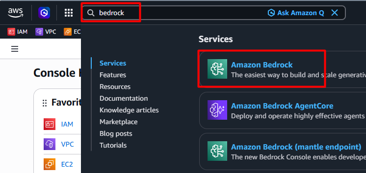
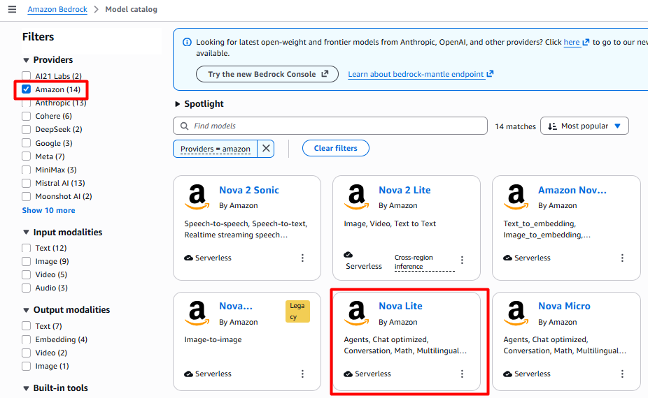
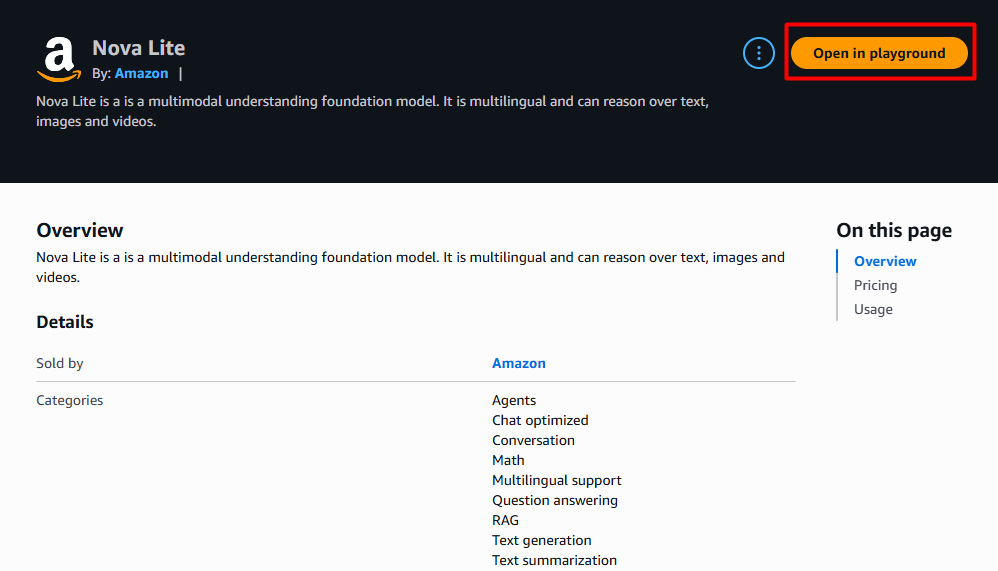
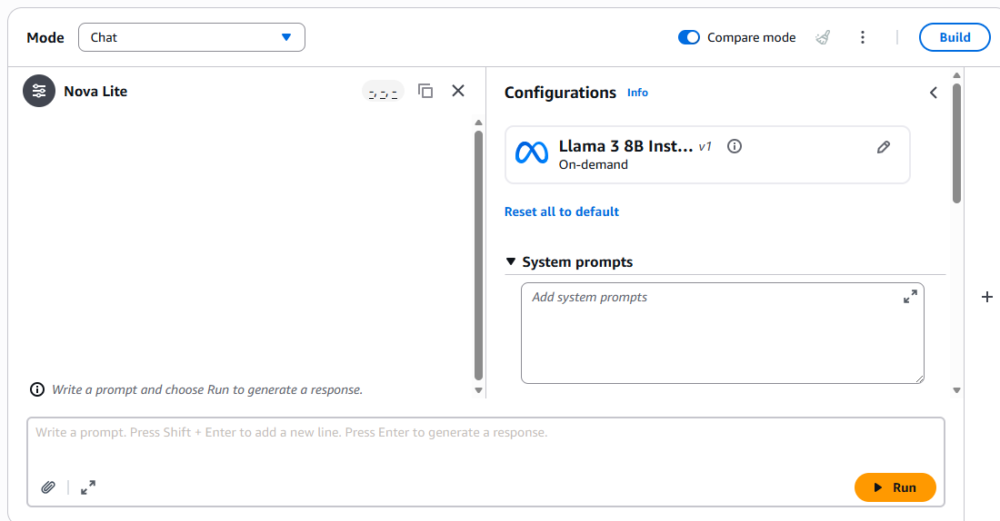
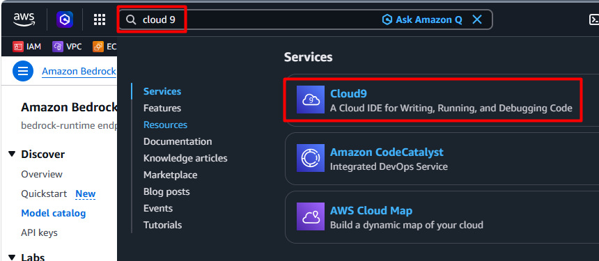
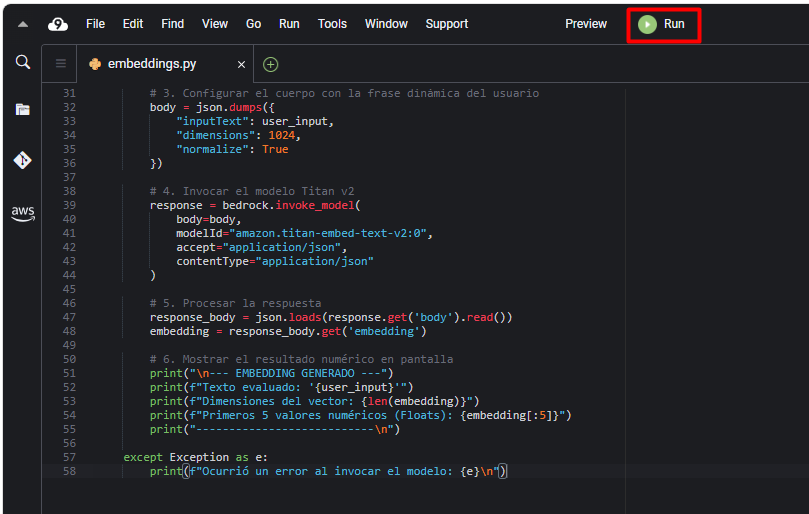
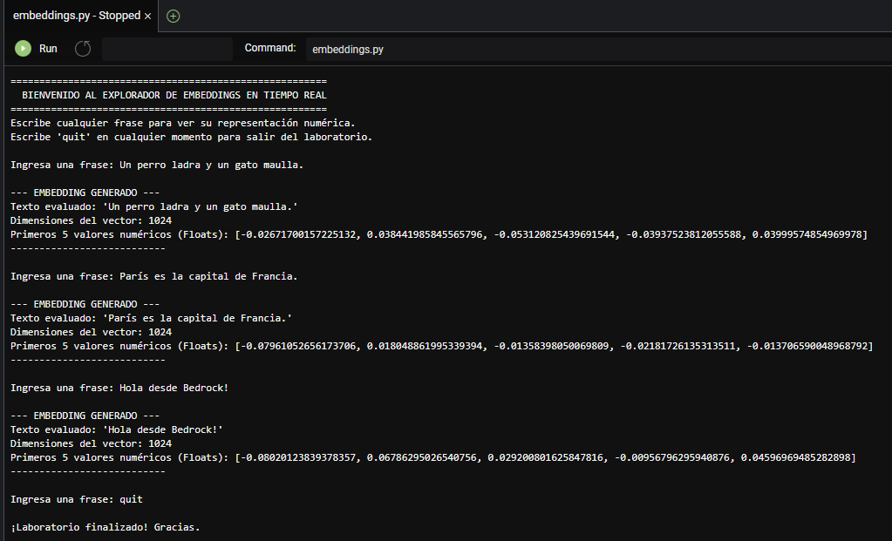

# Práctica 2 — Experimentos con Tokens, Temperatura, Embeddings y Comparativa de Modelos

## Metadatos

| Campo            | Detalle                                      |
|------------------|----------------------------------------------|
| **Duración**     | 30 minutos                                   |
| **Complejidad**  | Media                                        |
| **Nivel Bloom**  | Aplicar (*Apply*)                            |
| **Módulo**       | 2 — Componentes técnicos clave de GenAI      |

---

## Descripción General

En este laboratorio explorarás el potencial de la Inteligencia Artificial Generativa utilizando Amazon Bedrock. A través de una experiencia guiada de dos fases, pasarás de la experimentación visual e intuitiva en la consola de AWS a la interacción programática con modelos fundacionales avanzados.

---

## Objetivos de Aprendizaje

Al completar este laboratorio serás capaz de:

- [ ] Dominar la inferencia en la nube: Navegar por el Model catalog de Bedrock para identificar y evaluar diferentes arquitecturas de modelos.
- [ ] Controlar la creatividad de los LLMs: Manipular y comprender el impacto real de los hiperparámetros de generación (Temperatura y Top P) sobre las respuestas del modelo.
- [ ] Evaluar arquitecturas: Utilizar las herramientas de comparación de modelos para contrastar la velocidad, precisión y comportamiento de diferentes proveedores bajo un mismo prompt.
- [ ] Visualizar la semántica numérica: Invocar el modelo Amazon Nova Multimodal Embeddings mediante un script de Python para extraer y analizar la estructura de un vector, comprendiendo cómo las máquinas transforman el lenguaje humano en representaciones matemáticas estables.

---

## Entorno de Laboratorio

### Hardware mínimo recomendado

| Recurso      | Mínimo          | Recomendado     |
|--------------|-----------------|-----------------|
| RAM          | 8 GB            | 16 GB           |
| CPU          | 4 núcleos       | 8 núcleos       |
| Almacenamiento | 500 MB libres | 1 GB libres     |
| Internet     | 10 Mbps         | 25 Mbps         |

---

## Instrucciones Paso a Paso

### Acceso a Amazon Bedrock

1. En tu máquina virtual accede al navegador al link de acceso a la consola de AWS.

2. Usa el usuario y la contraseña otorgada por tu instructor. 

3. Una vez dentro de la consola, busca en la parte superior ```Bedrock```.



4. En el menú del costado izquierdo haz clic en **Model catalog**.

5. Explora los diferentes proveedores, contenido de entrara y contenido de salida.

### Definición de parámetros (Temperatura, Top-P, Top-K)

1. En los filtros, ubica la sección **Providers**, marca la casilla **Amazon** y luego haz clic sobre **Nova Lite**.



2. Revisa la información general y los detalles del modelo. 

3. En la parte superior derecha de la ventana haz clic en el botón **Open in playground**.



4. Prueba el modelo enviando el siguiente prompt:

```text
Soy el arquitecto de soluciones de un banco y requiero crear una infraestructura serverless en Azure como backup de la infraestructura en producción que tengo localmente. Define los componentes en viñetas y explícalo muy claramente en un párrafo.
```

5. Revisa la respuesta y anota los siguientes valores que aparecen en la parte de arriba de la ventana de chat:

* Input: ¿?
* Output: ¿?
* Latency: ¿?

Talvez te parezca bastante acertada la respuesta, sin embargo, vamos a probarlo nuevamente modificando algunos aspectos de los parámetros. 

6. Al costado del nombre del modelo **Nova Lite** hay un ícono de configuración, haz clic sobre este. 

7. Baja hasta la sección **Length** y configura los valores de la siguiente manera:

* Maximum output tokens: ```100```.
* Stop sequences: ```.```

7. Sigue bajando hasta la sección **Randomness and diversity** y configura los valores de la siguiente manera:

* Temperature: ```0.1```.
* Top P: ```0.1```.

8. Limpia el chat con el ícono de la "escoba" 🧹 del costado superior derecho del chat.

9. Lanza nuevamente el mismo prompt:

```text
Soy el arquitecto de soluciones de un banco y requiero crear una infraestructura serverless en Azure como backup de la infraestructura en producción que tengo localmente. Define los componentes en viñetas y explícalo muy claramente en un párrafo.
```
10. ¿Qué sucedió? De acuerdo a la explicación en clase intenta justificar el resultado. 

> 📝 **Respuesta:** La respuesta fue tan corta porque el parámetro **Stop Sequences** estaba configurado: al detectar esa secuencia en la generación, el modelo interrumpe inmediatamente la salida, incluso si aún no ha alcanzado el límite de tokens disponibles. Por eso el texto se detuvo tras el primer bullet, ya que la secuencia de parada actuó como un corte forzado, sin relación con el máximo de tokens ni con la temperatura o el Top‑P.

11. Cambia el valor **Maximum output tokens** a ```4000```, envía nuevamente el prompt y el resultado debería ser similar.

12. Ahora, quita el punto ```.``` del **Stop sequences**; deja el valor **Maximum output tokens** en ```4000``` e intenta nuevamente enviar el prompt.

13. Ahora sí debiste recibir nuevamente la respuesta completa. Compara la respuesta con la primera. Seguramente es imperseptible a primera vista, sin embargo, el modelo pasó de generar respuestas más variadas y creativas a ser mucho más determinista y repetitivo, eligiendo casi siempre el token más probable. Al mismo tiempo, reducir el Top‑P de 0.9 a 0.1 limita drásticamente el conjunto de candidatos, ya que sólo se consideran los tokens que acumulan el 10% de la probabilidad total, excluyendo casi todas las alternativas. En conjunto, la salida se vuelve mucho más corta, rígida y predecible, sacrificando diversidad y riqueza expresiva en favor de máxima coherencia y seguridad.

14. Probemos con un prompt. En la sección de configuraciones Haz clic en la opción **Reset all to default** que aparece al inicio. Boora el contenido del chat y escribe la siguiente solicitud:

```text
Escribe una lista de 10 animales y agrega una breve descripción creativa para cada uno.
```

15. Ahora cambia nuevamente los valores del **Randomness and diversity** de la siguiente manera:

* Temperature: ```0.1```.
* Top P: ```0.1```.

16. Compara los animales de cada respuesta y la descripción en cada uno de ellos. 

### Comparación de modelos

1. En la ventana del Playground del modelo **Nova Lite**, marca la casilla del costado superior **Compare mode**. La ventana del chat se dividirá en dos, del lado izquierdo **Nova Lite**; del lado derecho haz clic en el botón **Select model** y selecciona **Meta** -> **Llama 3 8B Instruct**. Haz clic en **Apply**.



2. Ingresa este prompt y documenta las diferencias clave. 

```text
Resuelve este problema paso a paso y luego crea una breve historia divertida con el resultado:  
"Si un tren viaja a 80 km/h durante 2.5 horas y luego reduce su velocidad a 50 km/h durante 1 hora, ¿cuál es la distancia total recorrida? Después, inventa una mini‑historia de 5 frases sobre un pasajero que vivió una aventura inesperada en ese viaje."
```

### Utiliza un modelo de embeddings para extraer su representación vectorial

1. En la parte superior de la consola de AWS busca y selecciona **Cloud9**.



2. Deberías ver un entorno creado, haz clic en **Open** bajo la columna **Cloud9 IDE**. Esto abrirá una nueva pestaña en tu navegador.

> ⚠️ Este proceso puede tardar un par de minutos. Si no tienes ningún entorno creado, consultale a tu instructor. 

3. Una vez en Cloud9, en el menú superior haz clic en **File** -> **New From Template** -> **Python File**

4. Agrega el siguiente código en el nuevo archivo creado:

```python
import boto3
import json
from botocore.config import Config

# 1. Configuración inicial del cliente de Bedrock Runtime
my_config = Config(signature_version='v4')
bedrock = boto3.client(service_name="bedrock-runtime", config=my_config)

print("=======================================================")
print("  BIENVENIDO AL EXPLORADOR DE EMBEDDINGS EN TIEMPO REAL ")
print("=======================================================")
print("Escribe cualquier frase para ver su representación numérica.")
print("Escribe 'quit' en cualquier momento para salir del laboratorio.\n")

# 2. Bucle infinito hasta que el usuario decida salir
while True:
    # Capturar la entrada del estudiante
    user_input = input("Ingresa una frase: ")
    
    # Condición de salida
    if user_input.strip().lower() == 'quit':
        print("\n¡Laboratorio finalizado! Gracias.")
        break
        
    # Validar que no envíen un texto vacío
    if not user_input.strip():
        print("Por favor, escribe algo válido.\n")
        continue

    try:
        # 3. Configurar el cuerpo con la frase dinámica del usuario
        body = json.dumps({
            "inputText": user_input,
            "dimensions": 1024,
            "normalize": True
        })

        # 4. Invocar el modelo Titan v2
        response = bedrock.invoke_model(
            body=body,
            modelId="amazon.titan-embed-text-v2:0",
            accept="application/json",
            contentType="application/json"
        )

        # 5. Procesar la respuesta
        response_body = json.loads(response.get('body').read())
        embedding = response_body.get('embedding')

        # 6. Mostrar el resultado numérico en pantalla
        print("\n--- EMBEDDING GENERADO ---")
        print(f"Texto evaluado: '{user_input}'")
        print(f"Dimensiones del vector: {len(embedding)}")
        print(f"Primeros 5 valores numéricos (Floats): {embedding[:5]}")
        print("---------------------------\n")
        
    except Exception as e:
        print(f"Ocurrió un error al invocar el modelo: {e}\n")
```

5. Guarda el script con **Ctrl+S** con el nombre ```embeddings.py```.

6. Haz clic en el botón **Run** de color verde en el costado superior central.



7. Prueba con algunas frases, puedes tomar las que están a continuación, y verifica el resultado.

```text
Un perro ladra y un gato maulla.
```

```text
París es la capital de Francia.
```

```text
Hola desde Bedrock!
```

Cuando quieras detener el programa, escribe: ```quit```.

### Resultado esperado

